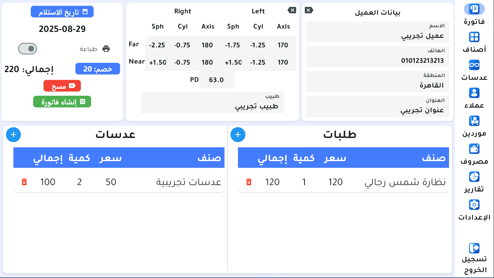
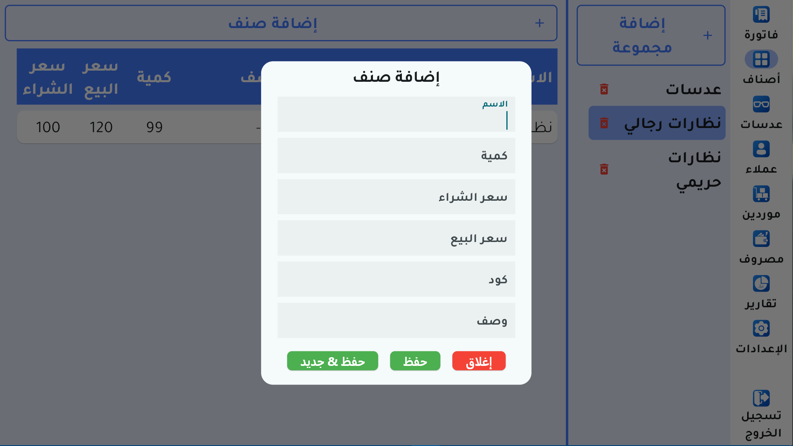
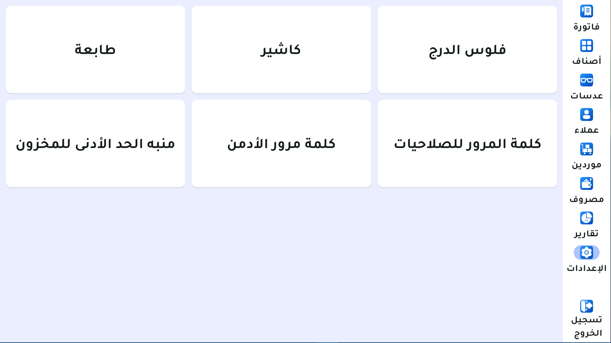
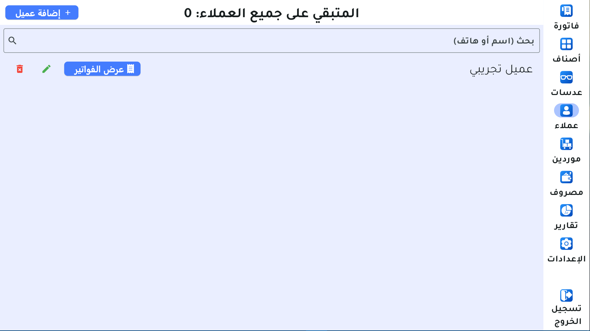

# Optics-Store-Demo
This is demo for app that is a management system designed for an optical shop. It helps with invoicing, inventory, and customer management. The user interface is clean, with a sidebar for easy navigation.

---

⚠️ **Note**:
- This repo contains **demo builds only** (no source code).  
- The all app data is wiped after app is closed.

---

## 🖼️ Screenshots

[▶️ Watch on Google Drive](https://drive.google.com/file/d/11BzVbuhZtgkNfEOOvE1VK4u2xafSenmG/view?usp=drive_link)

---

## App Features

1. Invoicing:

- Create and manage invoices.
- Record customer details.
- Add products and lenses to invoices.
- Apply discounts.
- Calculate the total amount.
- Set invoice dates.
- Print invoices.

2. Products:

- Manage product inventory.
- Add and categorize products (e.g., men's glasses).
- Add new items with details (name, quantity, prices, code, description).
- Delete items.

3. Lenses:

- Manage a separate inventory for lenses.
- Track quantity, purchase price, and selling price.

4. Clients:

- Search clients by name or phone.
- Add, edit, and delete client.
- View a client's invoice history.

5. Suppliers:

- A section for managing supplier details.

6. Expenses:

- A section to make, track, and manage business expenses.

7. Reports:

- A section for generating business reports (includes 9 different reports).

8. Settings:

- Configure app settings.
- Manage printer and cash drawer settings.
- Set up user permissions and passwords.
- Configure low-stock alerts.
